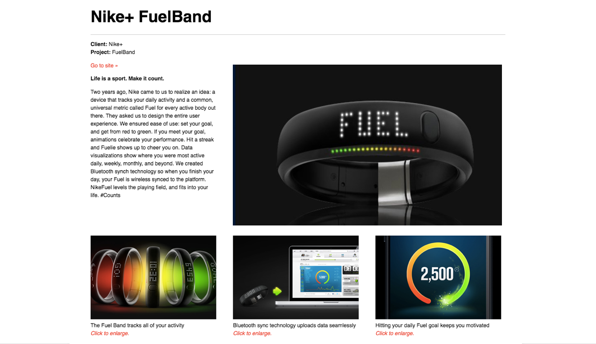

# Flexbox Layouts - Nike Fuelband

## Context

You are a front-end developer working for a UX agency who is looking to create a page to summarize their Nike Fuel Band campaign. The designer has provided you with a mockup for how the page should look and expects you to reproduce the design faithfully using HTML + CSS.

## The Assignment

Use HTML + CSS to implement the designer's styles on a static web page that represents the designer's mockup.

## Deliverables
- an `index.html` file with the content that links to the page's styles in a `styles.css` file
- a github repository named `flexbox-layouts-nike-fuelband`


## Setup Instructions
1. Create a new folder in your `~/muktek/assignments` directory called `flexbox-layouts-nike-fuelband`

2. Initialize a git repository in the `flexbox-layouts-nike-fuelband` folder

3. Create your `index.html` file. Make sure it has the proper `<!DOCTYPE>` declaration and the `<head>` and `<body>`

4. Create a `style.css` external stylesheet file. Make sure it has as the first style rule.

  ```css
  * {box-sizing: border-box }
  ```

5. Provide a `<link rel="stylesheet" href="........">` in the `<head>` of your `index.html` file to your `style.css` file. Ensure that the two files are connected by changing the `background-color` of the body.

6. Download the [project images file](./project-images.zip). Make sure you move the `.zip` file to your `~/muktek/assignments/flexbox-layouts-nike-fuelband` directory and unzip the images -- `unzip project-images.zip`.

7. Start writing your HTML + CSS.

### Mockup



### Designer Specs
```
font-family: Helvetica, Arial, sans-serif;
```


### Landing Page - Copywriting
```
Client: Nike +
Project: Fuel Band

Life is a sport. Make it count.

Two years ago Nike came to us to realize an idea: a device that tracks your daily activity and a common universal metric called Fuel for every active body out there. They asked us to design the entire user experience. We ensured ease of use: set your goal, animations celebrate your performance. Hit a streak and Fuelie shows up to cheer you on. Data visualization show where you were most active daily, weekly, monthly, and beyond. We created Bluetooth synch technology so when you finish your day, your Fuel is wireless synced to the platform. NikeFuel levels the playing field, and fits into your life. #Counts


=====
The Fuel Band tracks all of your activity
Click to enlarge

Bluetooth sync technology uploads data seamlessly
Click to enlarge.

Hitting your daily Fuel goal keeps you motivated
Click to enlarge.
```

### Images `.zip` download
[project images file](./project-images.zip)
